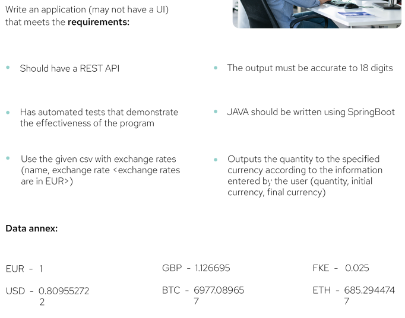

---

POST request body to `/api/exchange` path example:
```json
{
    "initialCurrency": "EUR",
    "finalCurrency": "BTC",
    "quantity": 100
}
```

---

TODO:
* API request model validation
* Malformed data csv handling
* Add Swagger?
* Add request data to response model?